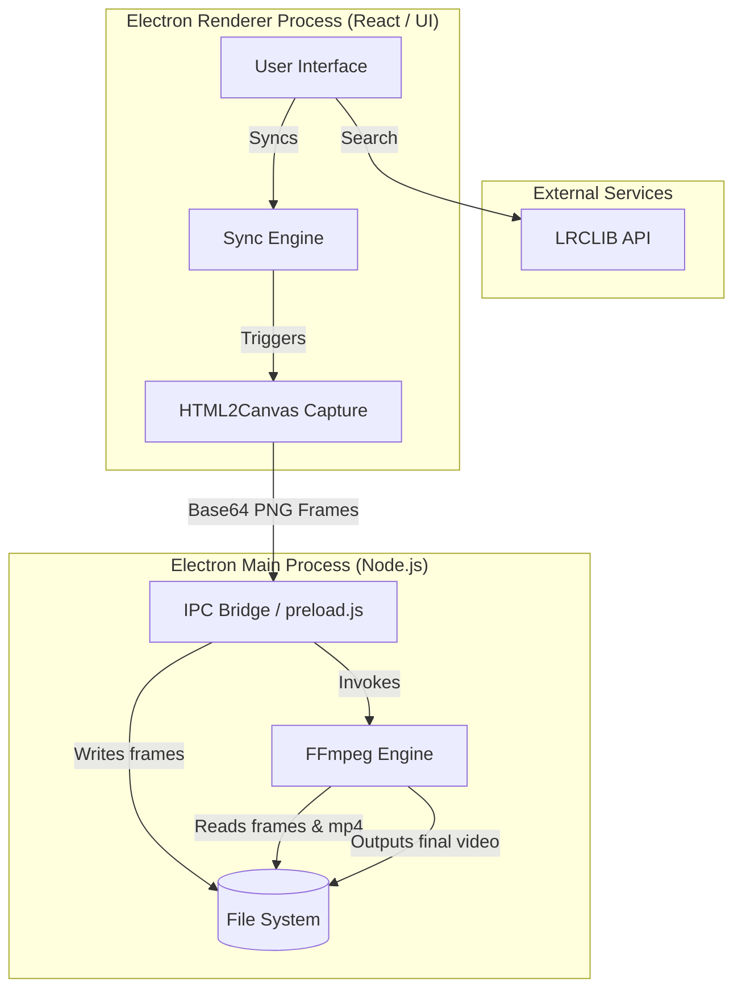

# Reels Lyrics Finder & Sync - Architecture

This document outlines the architecture and data flow of the Reels Lyrics Finder application. The primary design goal of this application is to perfectly render complex Tamil HarfBuzz typography while maintaining the flexibility to support modern CSS/React animations.

## System Overview

The application is built on top of **Electron**, using a strict two-process architecture (Main vs Renderer) communicating via IPC (Inter-Process Communication). 

- **Frontend (Renderer):** Built with **React** and **Vite**. Handles the UI, video playback, lyrics synchronization, and the deterministic rendering loop.
- **Backend (Main):** Native Node.js environment handling file system I/O, OS-level dialogs, and spawning **FFmpeg** processes.

---

## High-Level Architecture Diagram

---

## The Rendering Pipeline

The core technical achievement of this application is the **Deterministic Frame-by-Frame Renderer**. Standard FFmpeg subtitle burning (`libass`) cannot properly combine Tamil consonants and vowel modifiers because it lacks the HarfBuzz shaping engine. 

To solve this, the application captures the browser's perfect DOM rendering and converts it into a transparent video overlay.

### Export Sequence Diagram

When the user clicks "Render Preview", the application enters a deterministic loop. Time is artificially frozen and manually stepped forward to ensure every single frame perfectly matches the video's timestamp.

```mermaid
sequenceDiagram
    actor User
    participant React as App.jsx (Renderer)
    participant DOM as HTML Canvas
    participant Main as main.js (Main)
    participant FS as File System
    participant FFmpeg as fluent-ffmpeg

    User->>React: Clicks "Render Preview"
    React->>Main: ipcRenderer.invoke('start-render')
    Main-->>React: returns tempDir path
    
    rect rgb(40, 40, 60)
        note right of React: Deterministic 60 FPS Capture Loop
        loop For each frame (e.g., 900 frames)
            React->>React: video.currentTime = frame / 60
            React->>DOM: Await React Render Update
            React->>DOM: html2canvas(container)
            DOM-->>React: returns Base64 PNG
            React->>Main: ipcRenderer.invoke('save-frame', tempDir, frame, Base64)
            Main->>FS: fs.writeFileSync(frame_0000x.png)
        end
    end

    React->>Main: ipcRenderer.invoke('finish-render', videoPath, tempDir, 60fps)
    Main->>FFmpeg: Spawn FFmpeg
    FFmpeg->>FS: Read video.mp4
    FFmpeg->>FS: Read frame_%05d.png sequence
    FFmpeg->>FFmpeg: complex_filter: [1:v]scale=W:H, [0:v][ov]overlay
    FFmpeg->>FS: Write render_final.mp4
    FFmpeg-->>Main: Render Complete
    Main-->>React: success & finalPath
    React-->>User: Plays perfectly synced preview
```

## Why this Architecture?

1. **Perfect Typography:** Chromium natively handles complex text layout (CTL) and HarfBuzz ligature substitution. By capturing the DOM, we guarantee the output video looks identical to the editable preview.
2. **Future-Proof Animation:** Because the rendering loop manually steps `currentTime`, any future letter-level or word-level animations added to the React components will be captured flawlessly without dropped frames or stuttering.
3. **High-Fidelity Output:** Images are exported losslessly, and FFmpeg stitches them using `-crf 18` and `-preset slow` for near-lossless 60 FPS final video.
